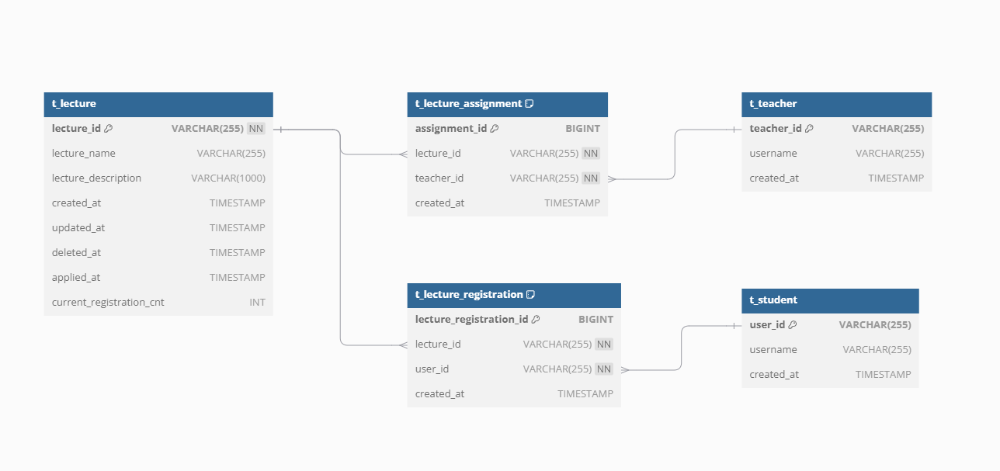

## 수강 신청 시스템

## ERD

## 테이블 연관관계
1. `` lecture와 teacher는 N:M 관계이기에 lecture_assignment를 둬서 1:N, N:1 관계로 풀었습니다.``   
2. `` lecture, student N:M 관계이기에 lecture_registration를 둬서 1:N, N:1 관계로 풀었습니다.``

## 테이블 정보 및 컬럼 설명

### 1. `t_Lecture_entity`

강의 정보를 저장하는 테이블

| 컬럼 이름                 | 데이터 타입  | 설명                        |
|---------------------------|--------------|---------------------------|
| `lecture_id`               | `VARCHAR(255)` | 고유 ID, 기본 키 (`PRIMARY KEY`) |
| `lecture_name`             | `VARCHAR(255)` | 이름                        |
| `lecture_description`      | `VARCHAR(1000)`| 설명                        |
| `created_at`               | `TIMESTAMP`    | 생성일                       |
| `updated_at`               | `TIMESTAMP`    | 수정일                       |
| `deleted_at`               | `TIMESTAMP`    | 삭제일                       |
| `applied_at`               | `TIMESTAMP`    | 신청가능일                     |
| `current_registration_cnt` | `INT`          | 현재까지 등록된 학생 수             |

### 2. `t_lecture_registration`

강의를 등록한 학생 정보를 저장하는 테이블

| 컬럼 이름                 | 데이터 타입    | 설명                                                  |
|---------------------------|----------------|-----------------------------------------------------|
| `lecture_registration_id`  | `BIGINT`        | 등록 고유 ID, 자동 증가 기본 키 (`AUTO_INCREMENT PRIMARY KEY`) |
| `lecture_id`               | `VARCHAR(255)`  | 강의 ID, `NOT NULL`                                   |
| `user_id`                  | `VARCHAR(255)`  | 학생 ID, `NOT NULL`                                   |
| `created_at`               | `TIMESTAMP`     | 생성일                                                 |
| `UC_lecture_user`          | `UNIQUE`        | `lecture_id`와 `user_id`는 유니크 인덱스                    |

### 3. `t_student`

학생 정보를 저장하는 테이블

| 컬럼 이름     | 데이터 타입    | 설명                             |
|---------------|----------------|--------------------------------|
| `user_id`     | `VARCHAR(255)`  | 학생 ID, 기본 키 (`PRIMARY KEY`) |
| `username`    | `VARCHAR(255)`  | 학생의 이름                         |
| `created_at`  | `TIMESTAMP`     | 학생 계정이 생성된 날짜와 시간              |

### 4. `t_teacher`
교사 정보를 저장하는 테이블

| 컬럼 이름     | 데이터 타입    | 설명                          |
|---------------|----------------|-----------------------------|
| `teacher_id`  | `VARCHAR(255)`  | 교사 ID, 기본 키 (`PRIMARY KEY`) |
| `username`    | `VARCHAR(255)`  | 교사 이름                       |
| `created_at`  | `TIMESTAMP`     | 생성일           |

### 5. `t_lecture_assignment`

강의와 교사 간의 배정 정보를 저장하는 테이블입니다.

| 컬럼 이름     | 데이터 타입    | 설명                                               |
|---------------|----------------|--------------------------------------------------|
| `assignment_id`| `BIGINT`        | 배정 ID, 자동 증가 기본 키 (`AUTO_INCREMENT PRIMARY KEY`) |
| `lecture_id`   | `VARCHAR(255)`  | 강의 ID, `NOT NULL`                                |
| `teacher_id`   | `VARCHAR(255)`  | 교사 ID, `NOT NULL`                                |
| `created_at`   | `TIMESTAMP`     | 생성일                                              |
| `UC_lecture_teacher`| `UNIQUE`    | `lecture_id`와 `teacher_id`는 유니크 인덱스              |

